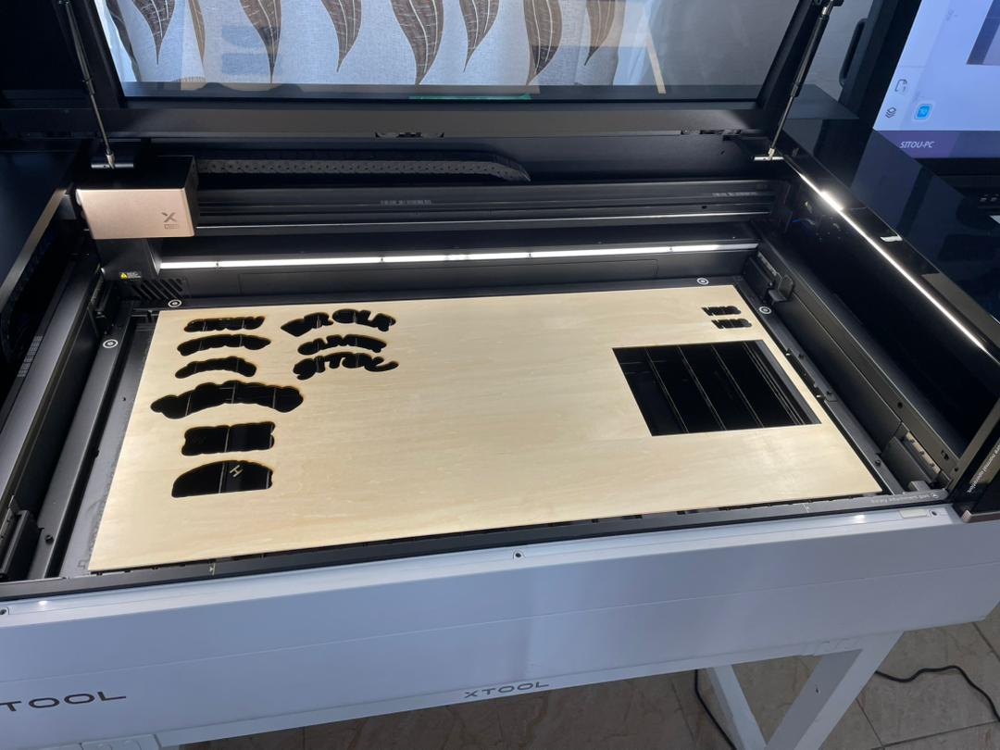

# JOURNAL - du mercredi 26-08-2026 (rédigé par Baleziou KAMDA) Groupe : Groupe 4

## Fait aujourd'hui

Pour cette journée, nous avons été répartis en 4 groupes de 25 personnes au maximum. En tant que membre du Groupe 4, j'ai suivi un parcours rotatif qui nous a permis de visiter quatre ateliers spécialisés d'une durée de 2 heures chacun.

- **Atelier 1 (Impression 3D) :** Découverte des principes généraux de la fabrication additive, de la chaîne logicielle et de la logique d'impression d'une pièce.
- **Atelier 2 (Préparation de projet) :** Présentation du cadre des projets intégrateurs et des contraintes techniques imposées.
- **Atelier 3 (Découpe Laser) :** Prise en main des machines, sécurité, et réalisation d'un test pratique en gravant/découpant nos prénoms sur du bois.
- **Atelier 4 (Électronique) :** Révision des notions fondamentales, calculs théoriques et manipulation d'instruments de mesure.
  
  [formation_electronique_fablab](C:\Users\zoulou\Downloads\formation_electronique_fablab.pptx)

## Appris

1. **Impression 3D :**

  - Chaîne logicielle : Modélisation sous **Fusion 360** et génération du fichier de découpe **G-code**.
  - Paramètres d'impression : Importance du réglage de la température de buse/plateau, de la vitesse et du choix du matériau (**PLA, PETG, TPU**).
  - Introduction aux principes de fonctionnement des machines **CNC**.
  
2. **Préparation de projet :**
  
  - Méthodologie pour concevoir un projet répondant à un besoin spécifique.
  - Cahier des charges matériel : Intégrer au minimum **1 capteur**, **1 microcontrôleur** (Arduino ou ESP32-S3) et **1 actionneur**.

3. **Découpe Laser :**

  - Fonctionnement théorique du faisceau laser et typologie des machines de marque **xTool** (**METAL FAB, T3, F2 ULTRA, M1 ULTRA**).
  - Utilisation du logiciel **xTool Studio** pour ecrir un text pour en suite imprimer sur bois.
  - Consignes de sécurité : Interdiction stricte de découper des matériaux poreux ou plastiques toxiques (ex. PVC).
  
     - exemple sur l'image  ci-dessous d'une découpe laser ouverte de marque xTool, avec sa tête laser montée sur l'axe en haut à gauche :
      le matériau est une plaque de contreplaqué posée dans la zone de travail. Le travail réalisé est la découpes des formes et des prénoms.

4. **Électronique :**
    
  - Identification des symboles schématiques, grandeurs électriques fondamentales et application de la **Loi d'Ohm** ($U = R \times I$).
  - Utilisation pratique du **multimètre** pour mesurer la tension (pile 1,5 V) et la résistance.
  - Lecture et calcul des **codes de couleur** des résistances (rôle des bandes de chiffres, multiplicateur et tolérance).

## Raté, puis corrigé

- **Manipulation du multimètre :** Difficulté initiale à choisir le bon calibre et à positionner les pointes de touche pour la mesure de tension et de résistance. 
  - *Correction :* Alignement de la molette sur la plage adaptée ($V_{DC}$ pour la pile, $\Omega$ pour les résistances) et vérification du bon contact des sélecteurs.
  
- **Calcul des résistances :** Risque d'erreur sur le sens de lecture du code de couleur.
  - *Correction :* Identification systématique de la bande de tolérance (souvent dorée ou argentée) à placer à droite avant de lire les bandes de gauche à droite.

## à faire demain

**Poursuivre l'apprentissage pratique et l'approfondissement dans les différents ateliers**.