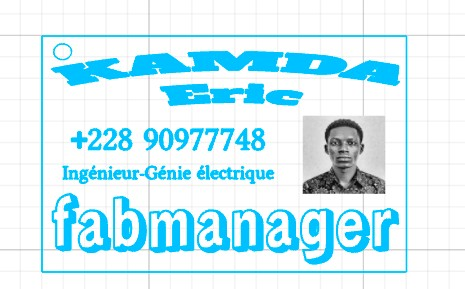
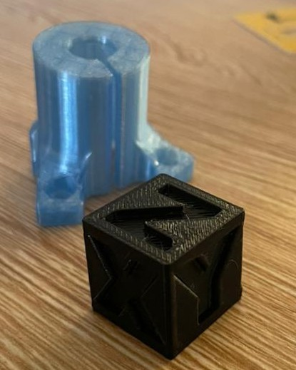

# JOURNAL - du jeudi 27-08-2026 (rédigé par Baleziou KAMDA)

## Fait aujourd'hui

Aujourd'hui, nous avons poursuivi l'apprentissage pratique dans les différents ateliers en réalisant des projets concrètes et en prenant en main de nouveaux logiciels.

- **Atelier Découpe Laser :** Expérimentation approfondie du logiciel **xTool Studio** avec la conception et la réalisation complète d'une carte de visite personnalisée.
  
  

- **Atelier Électronique & Programmation :** Installation du logiciel **mBlock** et présentation de son fonctionnement. Identification concrète des concepts d'**actionneur**, de **capteur** et de **microcontrôleur**. Réalisation d'un programme sur la carte **CyberPi** pour contrôler l'allumage des LED et concevoir un système de feu tricolore chronométré.

- **Atelier Impression 3D :** Installation et prise en main du logiciel de tranchage **Bambu Studio**. Apprentissage des paramétrages avant impression, sélection du profil pour l'imprimante **Bambu Lab P2S**, configuration du filament **PETG** et choix de la buse standard à 0,4 mm. Tranchage du plateau pour observer l'évolution de l'impression, suivi de la fabrication 3D de la pièce.

  

## Appris

   - Ajustement précis des paramètres de vitesse et de puissance pour un rendu net sur la carte de visite dans xTool Studio.
   - Rôle et distinction entre **capteur** (prise d'information), **microcontrôleur** (traitement par le CyberPi) et **actionneur** (exécution via les LED).
   - Programmation par blocs sous **mBlock**.
   - Gestion des temporisations pour créer le cycle d'un feu tricolore.

**Impression 3D (Bambu Studio) :**
   - Flux de travail complet sous **Bambu Studio** : importation, préparation.
   - Paramétrage du matériau **PETG** et définition du diamètre de buse à **0,4 mm**.
   - Simulation visuelle de l'évolution des couches d'impression avant le lancement sur la **Bambu Lab P2S**.

## Raté, puis corrigé

- **Gestion du temps du feu tricolore (mBlock) :** La séquence de changement des LED était trop rapide lors du premier essai.
  - *Correction :* Ajout de blocs de temporisation entre les états des LED pour obtenir un cycle réaliste.

- **Configuration avant tranchage (Bambu Studio) :** Risque d'erreur si le matériau sélectionné ne correspond pas au filament chargé dans la machine.
  - *Correction :* Vérification systématique de la sélection du profil **PETG** et de la buse **0,4 mm** avant de lancer le tranchage.

## Décider

- Continuer à nous exercer avec les logiciels à la maison.

## À faire demain

- Poursuivre l'apprentissage pratique dans les ateliers.