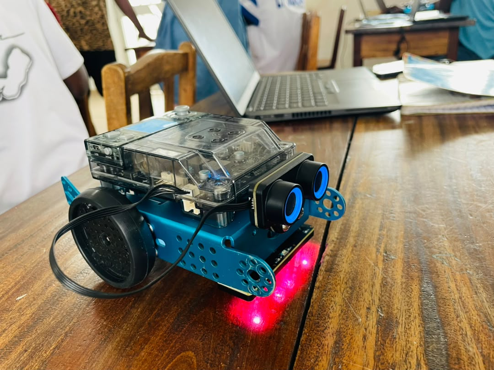

# JOURNAL - du mercredi 02-09-2026 (rédigé par Baleziou KAMDA) Groupe : Groupe 4 (Projet Groupe 17)

## Fait aujourd'hui

Aujourd'hui, nous avons travaillé sur les fondamentaux de la programmation, la logique des connexions sans code, la planification des projets, ainsi que la prise en main algorithmique du robot mBot2.

- **B.a.-ba de la programmation et des connexions physiques :** Étude du fonctionnement et de l'interaction directe entre capteurs et actionneurs, sans passer par un programme, pour comprendre physiquement la circulation des signaux.
- **Définition de la feuille de route projet :** Fixation et clarification des différents jalons de suivi pour le bon déroulement des 25 projets intégrateurs.
- **Programmation du robot mBot2 :** 
  - *Étape 1 :* Écriture d'un programme de base pour faire avancer le robot (gestion des moteurs).
  - *Étape 2 :* Intégration du capteur à ultrasons pour concevoir un algorithme d'évitement d'obstacles.

## Appris

1. **Logique des chaînes d'information et de puissance (Connexions Directes) :**
   - Compréhension de la relation directe **Entrée (Capteur) $\rightarrow$ Traitement $\rightarrow$ Sortie (Actionneur)**.
   - Manipulation purement matérielle permettant de visualiser comment un signal variable issu d'un capteur commande directement un actionneur (ex. variation de tension, état haut/bas) avant même de complexifier avec du code.

2. **Gestion de Projet & Jalons :**
   - Structuration du calendrier de développement (validation du cahier des charges, prototypage sur breadboard, modélisation 3D/PCB, fabrication au FabLab et tests finaux).

3. **Programmation sous mBlock (mBot2) :**
   - **Pilotage des moteurs :** Contrôle de la vitesse et de la direction pour un déplacement rectiligne.
   - **Boucle d'évitement d'obstacles :** Lecture en continu de la distance via le capteur à ultrasons.
   - **Condition logique :** Si la distance mesurée est inférieure à un seuil défini (ex. $20\text{ cm}$), le robot stoppe ou pivote ; sinon, il continue d'avancer.

## Raté, puis corrigé

## À faire pour la suite

- Transposer la logique de boucle conditionnelle et de lecture de capteurs apprise sur mBot2 vers notre microcontrôleur