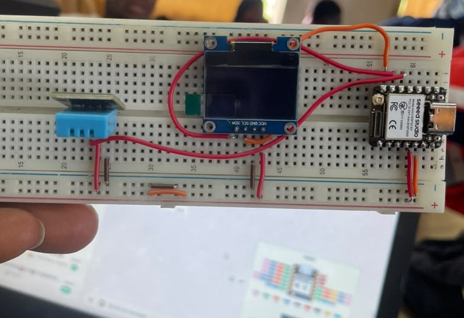
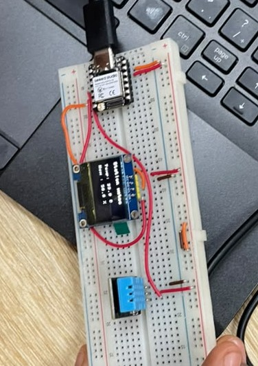

# JOURNAL - du samedi 05-09-2026 (rédigé par Baleziou KAMDA)

## Fait aujourd'hui

Aujourd'hui, nous avons réalisé un projet complet d'affichage de données météo en utilisant un microcontrôleur XIAO ESP32-S3 programmé en MicroPython.

- **Câblage sur plaque d'essai (SK10) :** Raccordement d'un écran OLED I2C et d'un capteur de température et d'humidité DHT11 au XIAO ESP32-S3.
  
- **Développement sous Thonny IDE :** Écriture et téléversement du script MicroPython pour gérer la lecture du capteur et l'affichage des données.
- **Mise en service du système :** Affichage en temps réel des statistiques météo (température et taux d'humidité) sur l'écran OLED.
  

## Appris

- **Communication I2C et bus de données :** Interfaçage de l'écran OLED avec l'ESP32-S3 via le protocole I2C (broches SDA et SCL).
- **Utilisation du DHT11 en MicroPython :** Exploitation des bibliothèques dédiées sous Thonny pour lire les grandeurs physiques (température en °C et humidité en %).
- **Prise en main du XIAO ESP32-S3 :** Identification du brochage (*pinout*) réduit de la carte XIAO et gestion de son alimentation sur la breadboard SK10.

## Raté, puis corrigé

## Décider

- Conserver ce modèle d'affichage I2C et ce script de base en MicroPython comme structure de référence pour de futurs affichages de données capteurs.

## À faire demain

- Réviser les acquis de la semaine et continuer à s'exercer sur la programmation d'écrans et de capteurs sous MicroPython.