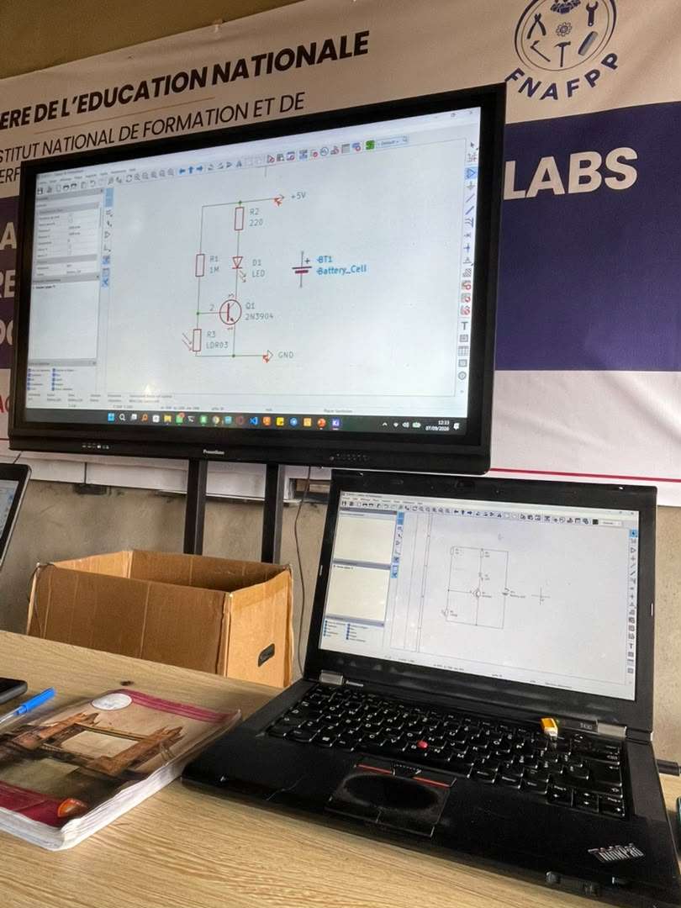

# JOURNAL - du lundi 07-09-2026 (rédigé par Baleziou KAMDA)

## Fait aujourd'hui

Aujourd'hui, nous avons débuté la formation sur la conception de circuits imprimés (PCB) avec la prise en main du logiciel KiCad et l'étude des principes de base de l'électronique.

- **Installation d'outils de CAO électronique :** Téléchargement et installation du logiciel **KiCad**.
- **Cours théorique sur les PCB :** Définition globale d'un PCB (*Printed Circuit Board*) et analyse de l'anatomie d'une carte électronique (couches de cuivre, sérigraphie, masque de soudure, vias).
- **Méthodologie de conception :** Étude des étapes de passage de l'idée théorique au schéma électronique normalisé.
- **Exercice pratique à réaliser :** Recherches individuelles sur les différents composants électroniques de base et leurs rôles respectifs.

## Appris

- **Anatomie d'un PCB :** Rôle des différentes couches qui composent un circuit imprimé (substrat FR4, traces en cuivre, vernis épargne / *solder mask*, et sérigraphie pour le repérage des composants).
- **Règle fondamentale d'ingénierie :** **Toujours réaliser et valider le schéma électrique théorique (*schematic*) avant d'entamer la fabrication ou la disposition physique des composants.**
- **Chaîne de conception sous KiCad :** Logique de création allant du choix des symboles électriques à la génération du schéma avant le routage.

## Raté, puis corrigé

- **Tendance à vouloir dérouter la carte avant le schéma :** Risque d'erreur d'interconnexion en manipulant directement les empreintes de composants.
  - *Correction :* Respecter scrupuleusement le workflow en finalisant d'abord le schéma électrique propre et annoté sous KiCad.

## Décider

- Réaliser une fiche de synthèse récapitulant les principaux composants électroniques (résistances, condensateurs, diodes, transistors, microcontrôleurs) et leurs rôles pour préparer les prochains schémas sous KiCad.

## À faire demain

- Poursuivre la prise en main de KiCad et commencer le dessin du premier schéma électrique.