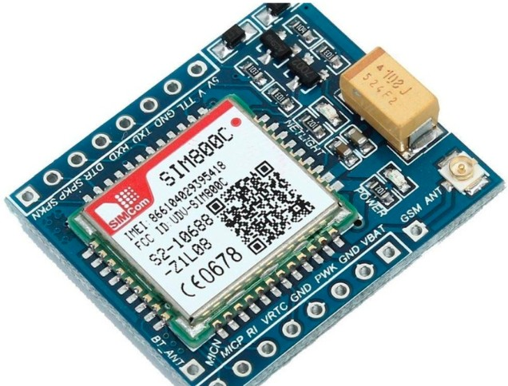

# JOURNAL - du vendredi 11-09-2026 (rédigé par Baleziou KAMDA)

## Fait aujourd'hui

Aujourd'hui, nous avons poursuivi les tests matériels sur les modules de communication GSM et cherché des solutions aux problèmes de réseau rencontrés.

- **Diagnostic du module SIM900A :** Identification de la cause de l'échec de connexion au réseau (problème d'opérateur/carte SIM bloquée).
- **Test d'un module alternatif (SIM800C) :

** Remplacement de la carte SIM et tentative d'interfaçage avec le module SIM800C.
- **Analyse du dysfonctionnement :** Constat que le SIM800C ne parvient pas non plus à s'enregistrer correctement sur le réseau.
- **Réflexion sur des alternatives :** Début de recherche de solutions pour la communication sans fil.

## Appris

- **Dépendance matérielle et réseau GSM :** L'échec d'accroche réseau ne provient pas uniquement du module mais peut découler d'un blocage SIM (opérateur, verrouillage PIN) ou de la restriction progressive des bandes 2G par les opérateurs locaux.
- **Importance de la redondance en Prototypage :** Nécessité d'avoir des options de secours (Wi-Fi, LoRa, ESP-NOW) quand un protocole de communication principal pose problème.

## Raté, puis corrigé

- **Persistent dysfonctionnement de la communication GSM (SIM900A / SIM800C) :** Aucun des deux modules n'a permis d'établir une connexion réseau stable.
  - *Correction :* Analyse en cours pour basculer vers un autre protocole de communication ou remplacer les modules par une version 4G (ex. SIM7600E).

## Décider

- Réfléchir et valider d'ici demain une alternative technique crédible au GSM pour assurer la transmission des données du projet.

## À faire demain

- Définir et tester la solution alternative de communication retenue pour débloquer l'avancement du prototype.