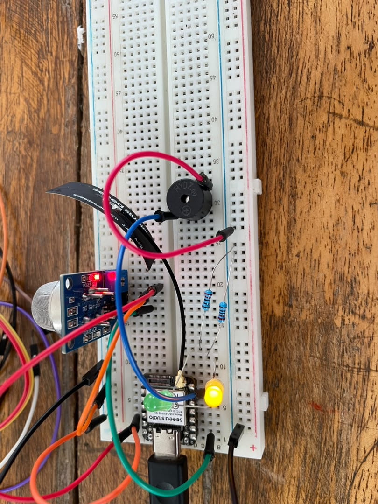
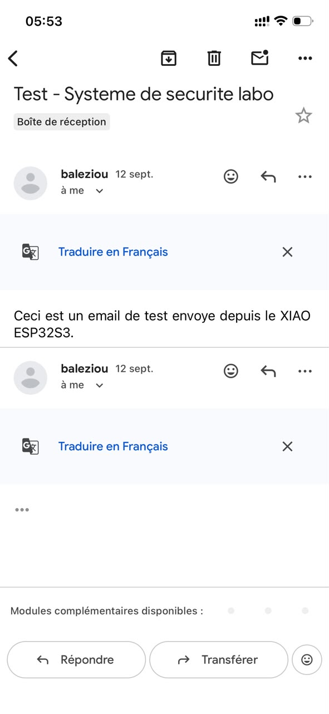
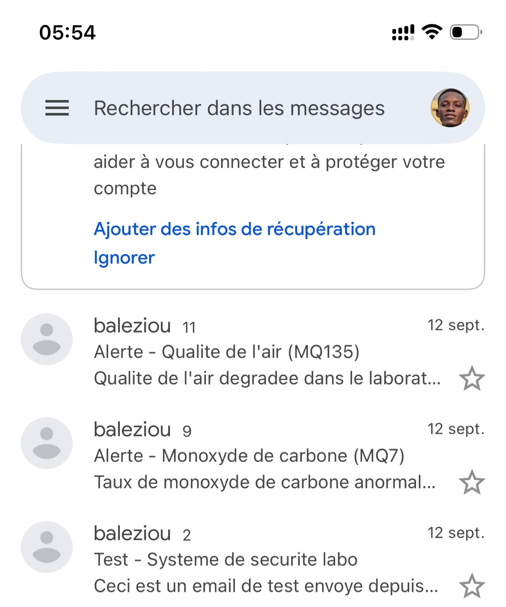

# JOURNAL - du dimanche 13-09-2026 (rédigé par Baleziou KAMDA)

## Fait aujourd'hui

Aujourd'hui, nous avons validé le fonctionnement individuel de tous nos capteurs et mis en place une solution alternative de communication basée sur le Wi-Fi et les alertes Gmail.

- **Validation unitaire du matériel :** Test individuel de chaque capteur en exécutant son code de contrôle dédié.

- **Mise en place d'un portail Captif (WiFiManager):** 

 Création d'une passerelle de connexion sur l'ESP32-S3 permettant de configurer facilement un nouveau réseau Wi-Fi sans modifier le code.
- **Intégration du protocole d'alerte Email :** 
 

 
 Configuration de l'envoi automatique de notifications par Gmail depuis l'ESP une fois la connexion Wi-Fi établie.

## Appris

- **Gestion dynamique de la connectivité Wi-Fi :** Mise en œuvre d'un point d'accès temporaire (*Access Point*) sur l'ESP pour saisir les identifiants Wi-Fi via une interface web locale.
- **Protocole d'envoi d'e-mails (SMTP) :** Utilisation du Wi-Fi et des identifiants sécurisés Gmail (mot de passe d'application) pour transmettre des alertes sans dépendre du réseau GSM.
- **Validation modulaire :** Importance de tester chaque capteur séparément avant de les intégrer dans un programme global.

## Raté, puis corrigé

- **Blocage de l'ESP32 lors de la première tentative d'envoi d'e-mail :** Échec d'authentification lié à la sécurité du compte Gmail.
  - *Correction :* Activation de la double authentification et génération d'un mot de passe d'application dédié pour autoriser la connexion SMTP de l'ESP32.

## Décider

- Conserver la passerelle Wi-Fi et les alertes Gmail comme système principal ou de secours pour pallier les problèmes d'accroche réseau des modules GSM.

## À faire demain

- Combiner la lecture de tous les capteurs validés au sein d'un même programme pour déclencher l'envoi d'e-mail automatique en cas d'événement.