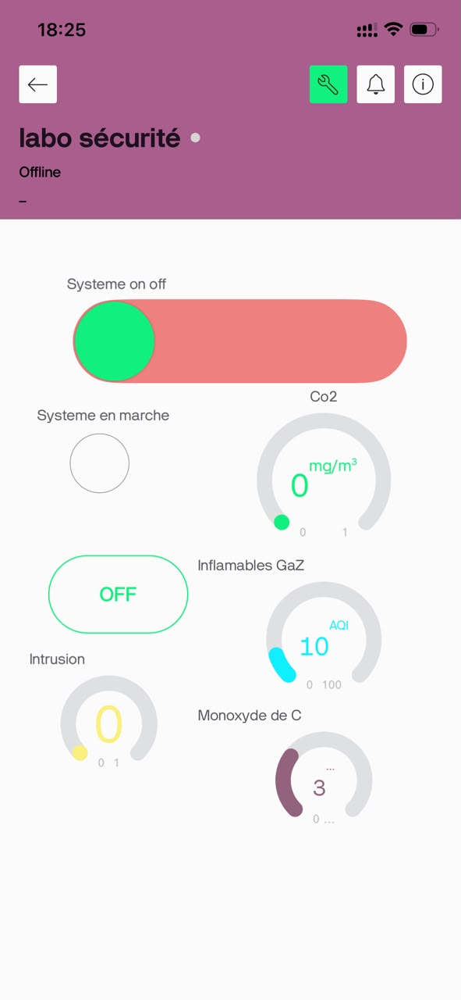

# JOURNAL - du lundi 14-09-2026 (rédigé par Baleziou KAMDA)

## Fait aujourd'hui

Aujourd'hui, nous avons poursuivi le développement technique en combinant l'optimisation du PCB, la programmation et la mise en place d'une interface IoT.

- **Conception PCB :** Poursuite et affinement du tracé du circuit imprimé sous KiCad.
- **Intégration de la plateforme Blynk :** Configuration de l'application Blynk pour superviser et surveiller en temps réel l'état des différents capteurs.

- **Développement logiciel :** Poursuite de la structuration du code de contrôle pour l'ESP32.

## Appris

- **Supervision IoT avec Blynk :** Liaison des variables du programme ESP32 à des widgets virtuels (*Virtual Pins*) sur Blynk pour visualiser l'état des capteurs à distance.
- **Optimisation du code :** Structuration de la lecture des capteurs et de la transmission périodique des données vers Blynk sans bloquer la boucle principale.

## Raté, puis corrigé

- **Déconnexions intempestives de l'ESP32 sur Blynk :** L'utilisation de boucles de délai classiques (`delay()`) bloquait le traitement des requêtes réseau de la plateforme.
  - *Correction :* Remplacement des délais bloquants par une gestion du temps non bloquante (`millis()` ou temporisateurs Blynk) pour maintenir le lien Wi-Fi actif.

## Décider

- Valider la communication entre l'ESP32 et Blynk avant de figer définitivement le schéma et le typon du PCB.

## À faire demain

- Finaliser le routage du PCB sous KiCad et poursuivre les tests de stabilité sur l'interface Blynk.